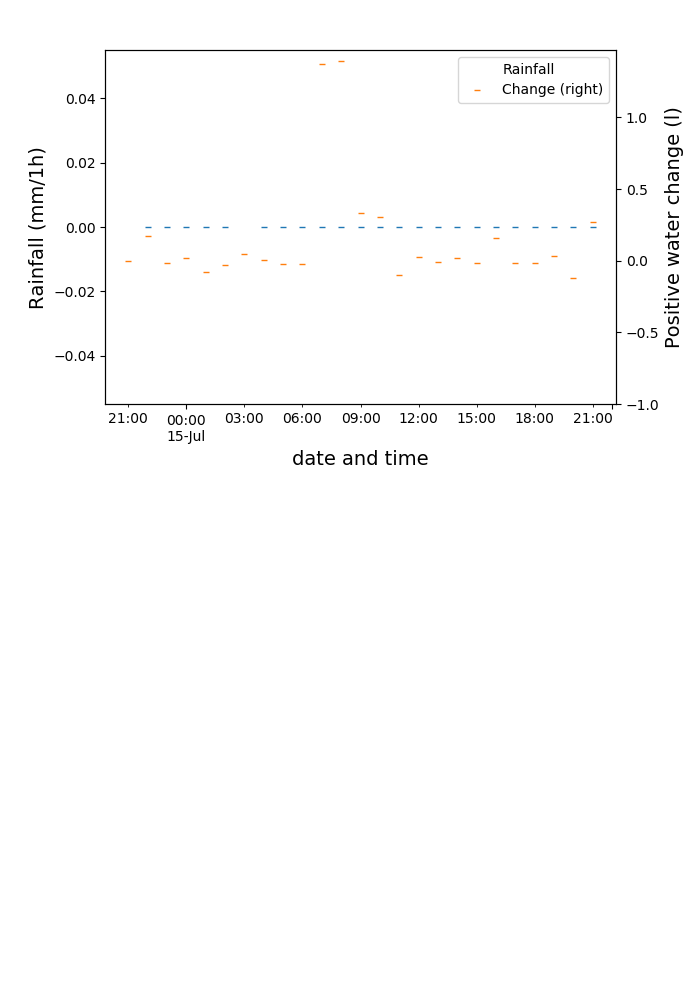

# Water Level Monitor

The water level of the water butt is read automatically through an ultrasonic distance sensor (JSN-SR04T-2.0). 

The figure below shows the water content over the course of the current month. 

Rainfall data (from weather station [Paris 6ème - Saint Germain des Prés](https://www.infoclimat.fr/observations-meteo/temps-reel/paris-6eme-saint-germain-des-pres/000CT.html)) and water collected in water butt compared. 

Other months can be found in the [`figures`](figures/) folder. 

