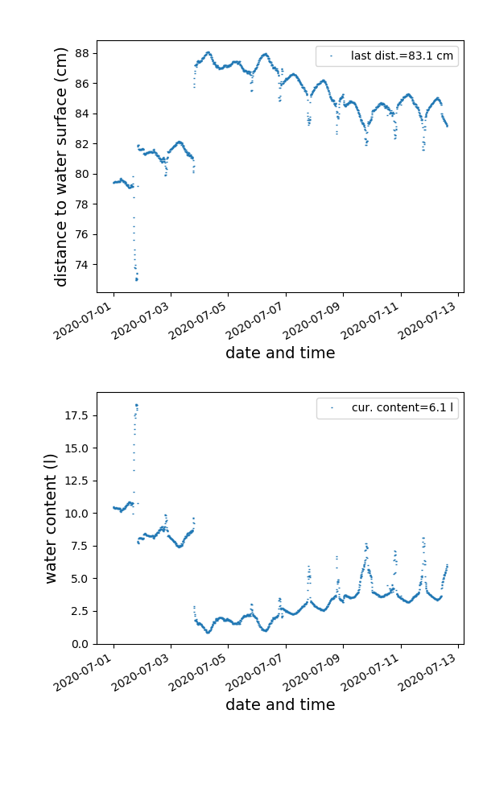

# Water Level Monitor

The water level of the water butt is read automatically through an ultrasonic distance sensor (JSN-SR04T-2.0). 

The figure below shows the water level time course of the current month. 

Other months can be found in the [`figures`](figures/) folder. 
